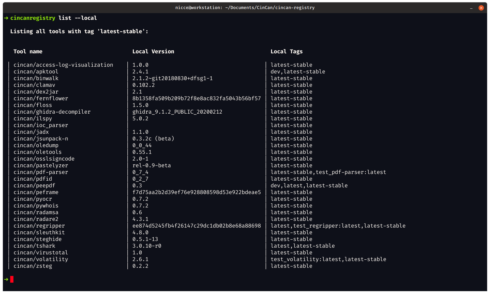

[](https://gitlab.com/CinCan/cincan-registry/commits/master)

# CinCan Registry

CinCan registry is  a tool for listing available CinCan tools, their versions, size and possible updates. 

 Available tools can be found in the CinCan's [tool repository.](https://gitlab.com/CinCan/tools) In practice, source code for tools' Dockerfiles is available in there.

Currently, no other tools are supported for version information listing or for other details.

Docker images of remote tools are stored in Docker Hub, [under CinCan's profile.](https://hub.docker.com/u/cincan)

When checking versions beyond remote (Docker Hub), tool is using multiple different APIs such as GitHub's or GitLab's to acquire most recent availabe versions straight from the source. See more in [upstream checking.](#upstream-checker)

## Installation

Tool can be installed by running following command:

`pip install git+https://gitlab.com/cincan/cincan-registry`

Tool is not currently in pip, but should be in future.

## Usage

### Regular listing

The main purpose is to list available local or remote CinCan tools and their sizes and versions.

We are also able to list upstream versions of tools, for those where this feature is configured. This is handled more thoroughly in [Upstream Checker section.](#upstream-checker)


To list both available local and remote tools with tag "latest-stable", simply write
```
cincanegistry list

```

When running first time, output could look something like this:


By default, "latest-stable" tag is always used, unless overrided with `--tag` or `-t` argument.

<!--  -->


To list only locally available tools with tag "latest-stable", argument `--local` (or `-l`) can be used. Additionally, when listing only tools for specfic location, listing will show all viable tags pointing into same image.

```
cincanregistry list --local
```
Example ouput should look something like this:




To do same for remote, use `--remote` (or `-r`) argument. By adding flag `-a`, this shows tools with all possible tags.
```
cincanregistry list --remote -a 
```

All commands are supporting JSON output. Simply add `--json` or `-j` argument. To combine previosly mentioned `-t` flag, we can use following arguments to provide JSON output:

```
cincanregistry list -ljt latest
```
This lists locally available tools with 'latest' tag in JSON format.

JSON will contain also size of the images. For `local` images, size is *uncompressed* and for remote images, it is *compressed* size. 

By adding size column for regular listing, `--size` (or `-s`) argument can be used.

To list local images with all tags and size column included:
```
cincanregistry list -lsa
```

### Version listing and comparison

To see more about versions, we need to use `versions` subcommand. By running

```
cincanregistry list versions
```

tool will fetch version information from configured upstreams. By default it lists only locally available tools, and compares their versions into remote versions, and further remote versions into upstream versions. 

**With help of this, we should be always acknowledged whether our tool is *really* up-to-date or not!**

Current implemention lists those tools as red `#AA0000`, where is immediate update available on remote. (local version differs from remote)

If local and remote are equal, but possible upstream of the tool has update, those are listed as grey `#808080`. 


As seen in the above image, green should indicate, that at least for that line, everything there is *fine*.

Argument `--name` (or `-n`) can be used to check updates for single tool, and exclusive argment `--only-updates` or `-u` can be used to show only tools where there are updates available.

It should be noted, that tool is not able to directly tell, if there is update available. It only detects deviations. 

They ways how versions are marked, are differing too much. However tool is very good at detecting same versions, even if they are marked bit differently.

Most of the preceeding arguments with `list` subcommand will change the behaviour of `versions` subcommand as well.

For example command:
```
cincanregistry list -rj versions --only-updates
```

Will produce JSON output from remote tools; generating their versions and filtering only for onces with available version updates, after checking configured upstreams for those available.


### All available options

| Specific to `list`      |    | Description |
|-------------------------|----|-------------|
| --config                | -c | Path to configuration file |
| --tag                   | -t | Filter images by tag name. |
| --all                   | -a | Show images with all tags. (Excludes --tag or -t) |
| --size                  | -s | Inlcude  size column when listing |
| --json                  | -j | Produce output in JSON format
| --local                 | -l | List only locally available 'cincan' tools. Excludes --remote or -r
| --remote                | -r | List remotely available 'cincan' tools. Excludes --local or -l

Size will be here always included in JSON regardless is it used with it or not.

| Specific to `list versions` |    | Description
|-------------------------|----|-------------|
| --name                  | -n | Check single tool by the name.
| --only-updates          | -u | Lists only available updates. Excludes --name or -n
|

These can be used with the combination of `list` options to produce varying outputs.


## More in depth

This tool takes advantage of Docker Hub's Registry API, when listing remote tools and their sizes and versions. Version information is extracted from `manifest` file, which is containing the configuration of Docker Image. More presicely, version information value is acquired for `TOOL_VERSION` environment variable in the configuration.

This same variable is used for acquiring the version information on local as well, however we are using configuration information provided by `Docker Engine`.

Docker Images should have been build by using this variable, so the information is correct.

## Upstream checker

CinCan Registry has feature to check available new versions for tool, if this feature is just configured for selected tool.

This is based on looking for latest available release, tag-release, commit or other means of providing version information in original sources.
